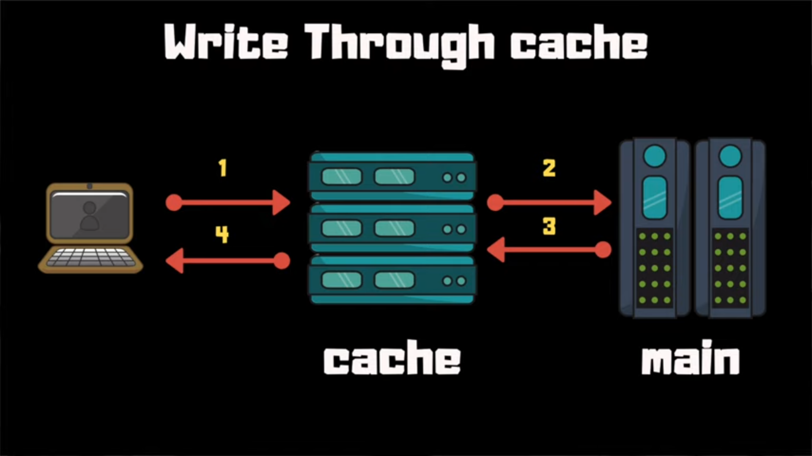
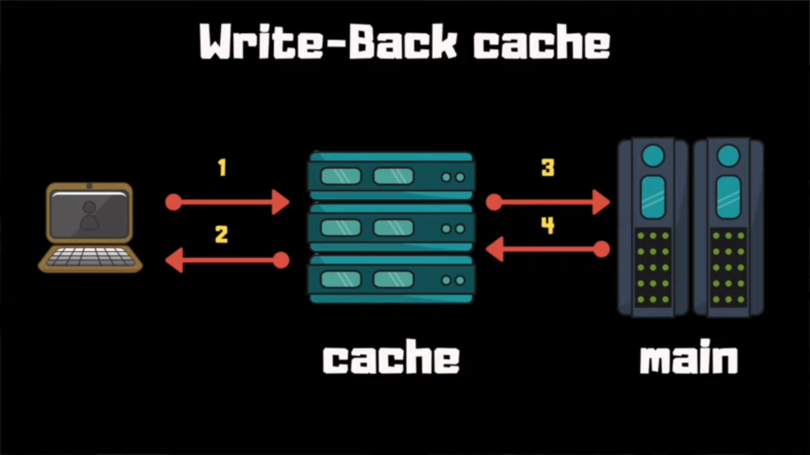

# Different Caching Approaches

Different types of chaching approaches ok to understand this we have to first understand what is a cache memory. What is caching and how does caching work so let's break down into different parts to make it more simpler.

## Cache Memory 

cache memory is a high speed memory which is small in size. It acts a buffer between cpu and main memory and holds data and program which is frequently used by the cpu

| Advantages      | Disadvantages          |
| ----------------| ---------------------- |
| Faster than main memory  | limited capacity |
| It consume less access time | Expensive |

## Caching 

The idea of introducing caching layer in your app is because the mechanism or cost of obtaining the certain amount of data is high or you can say it's a costly operation to go back to database search for the data and bring it back. You want to introduce a backup fast access so you don't have to go everytime through that slow storage. 

In more technical term we can define Memory caching as a technique in which computer applications temporarily store data in a computer’s main memory (i.e., random access memory, or RAM) to enable fast retrievals of that data. The RAM that is used for the temporary storage is known as the cache.

## How does Memory caching works

It works by first reserving a portion of RAM to be used as cache. When an  application tries to read data from typically from the data storage system like database first it checks if the data is already present in cache or not if it does then the application will read data from the cache and avoids the slower process of reading that data from the database. If its not present in the cache then the application reads the record from the source. When it retrieves that data, it also writes the data to the cache so that when the application needs that same data in the future it can quickly get it from the cache.

## Caching Approaches

Different caching approaches are 

* Locality of reference 
* Distributed Caching 


### Locality of reference 

Locality of reference refers to a phenomenon in which a computer program tends to access same set of memory locations for a particular time period.

 There are two ways with which data or instruction is fetched from main memory and get stored in cache memory. These two ways are the following:


* Temporal Locality  

        Temporal locality means current data or instruction that is being fetched may be needed soon. So we should store that data or instruction in the cache memory so that we can avoid again searching in main memory for the same data. When CPU accesses the current main memory location for reading required data or instruction, it also gets stored in the cache memory which is based on the fact that same data or instruction may be needed in near future. This is known as temporal locality.
         let us say a process has been created in RAM and that process name is A and it is accessing A` in the HDD so if it accessing in a sequence like A` B` C` A` D` A` then we say that A` has been accessed more time so it would be good to store A` some where in the RAM so that we don't have to go to HDD because coming from the RAM to the HDD takes a huge amount of time but if the same data is present in our RAM then it takes much less time. This type of locality of reference in which most freq item is stored in the RAM is called as temporal locality it is also called as LRU cache as the least recently usesd data is throwed away and while the most recently used data is bubbled up. 
        


* Spatial Locality  

        Spatial locality means instruction or data near to the current memory location that is being fetched, may be needed soon in the near future. This is slightly different from the temporal locality. Here we are talking about nearly located memory locations while in temporal locality we were talking about the actual memory location that was being fetched.
        If we are accessing something like A` data then the possiblity of B` C` which are in the locality of A` is high so lets us take an example of a class. 3 students are sitting in a row if the teacher ask some question to student1 and if he's not able to answer than you can think that the one sitting beside the student1 which is student2 will be the most likely to asked the same question or next question. It based on the predection as the application needs to be predict what is gonna need then it is usefull to pull the spatial located data as maybe this data is usefull in the future.
  
        
* Distributed Caching 

        A  distributed caching is an extension of the traditional concept of cache used in a single location. It is mainly used to store app data residing in database and web session data. It is kind of combination of both spatial and temporal caching but here you need to keep cache in sync with the main data store.
        Generally a backend app stores data in databse when a client app request for any data then the app server first query the data and then fetch the data from database and return it to the user but reading data from the database is a time consuming activity so if thousands of user are looking for same data multiple number of times then the app server have to fetch same data again and again as fecting data from database is a costly operation so overall performance of system decreases that's why we placed cache server in between the application server and the database. So with the help of cache in distributed system we can fetch data fast from the cache memory and our application starts responding fast and make flawless experience to the user.

        


Distributed caching is divided into two methods 

* Write through cache

         Under this method the data is first written to the cache and then to the database. So you update your cache and syncronously block the client to write to there disk





* Write back cache

         Under this method the database is updated asynchronously.First data is write to the cache and then we are done the cache will write asyncronously to the datastore. Data is updated in the memory only when the cache line is ready to replaced.





 
## Cache Eviction Policies

* First In First Out (FIFO) 
* Last In First Out (LIFO) 
* Least Recently Used (LRU) 
* Most Recently Used (MRU)
* Lesat Frequently Used (LFU)
* Random Replacement (RR)


### LRU Cache pseudo-code

```javascript
    var  cache = {}
    var currentSize =0;
    var maxSize ;
    var mostRecent = DoublyLinkList();

    function insertKeyvaluepair(key ,value){
            if(!key in cache){
              if (currentSize == maxSize){
                      evictleastrecent();
              }else{
                      currentSize +=1;
                      cache[key] = DoublyLinkList(key,value);
              }
      }else{
              replacekey(key,value);
      }
       updatemostrecent(cache[key]); 
    }

     function replacekey(key ,value){
           cache[key] = value;  
     }
     function evictleastrecent(){
        let keytoremove = mostRecent.tail.key;
        mostRecent.removetail();
        delete cache[keytoremove];
     }
     function updatemostrecent(node){
             mostRecent.unshift(node);
     }
     function getvaluefromkey(key){
             if(!key in  cache) return null;
             updatemostrecent(cache[key]);
             return cache[key].value;          
    }

    function getmostrecent(){
            return mostRecent.head.key;
    }

  }
```


####  Reference Links

 [Geeks for Geeks](https://www.geeksforgeeks.org/locality-of-reference-and-cache-operation-in-cache-memory/)


 [Medium](https://medium.com/rtkal/distributed-cache-design-348cbe334df1)

 
 [aws-amazon](https://aws.amazon.com/caching/)


